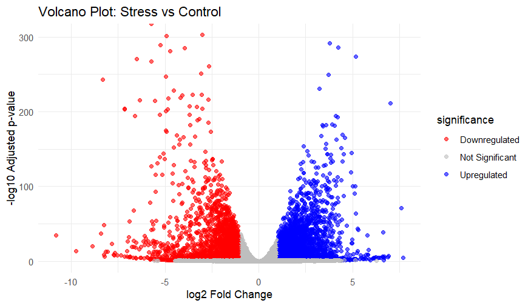

# RiceStress_DESeq2
A transparent RNA-seq workflow for rice drought stress analysis. Built for reproducibility and educational impact using Galaxy and DESeq2.
# RNA-seq Analysis of Rice under Drought Stress
This repository presents a reproducible pipeline for identifying drought-responsive genes in rice (Oryza sativa) using RNA-seq data. The workflow includes data acquisition from NCBI SRA, preprocessing in Galaxy, differential expression analysis with DESeq2, and visualization in R.

## Project Objective
To identify and visualize genes significantly upregulated or downregulated in rice leaves under drought stress compared to well-watered controls, using a transparent and reproducible bioinformatics workflow.

## Repository Structure
RiceDrought_DESeq2/
├── data/         # Raw and filtered count matrices  
├── scripts/      # R script for volcano plot generation  
├── results/      # DESeq2 output table  
├── figures/      # Volcano plot image  
├── README.md     # Project overview and structure  
└── methods.md    # Detailed analytical workflow  

#Volcano Plot

Genes were classified as:
- Blue -> Upregulated: log2FC > 1 and padj < 0.05  
- Red -> Downregulated: log2FC < -1 and padj < 0.05  
- Grey -> Not Significant: all others

# Author
Zahra Sabili  
Fars, Iran  
Plant Biotechnology & Bioinformatics Researcher | MSc Graduate
Email: ztsabili96@gmail.com
# Citation & Reuse
This repository is open for reuse and adaptation. Please cite or acknowledge the GitHub link if used in publications or derivative work.

